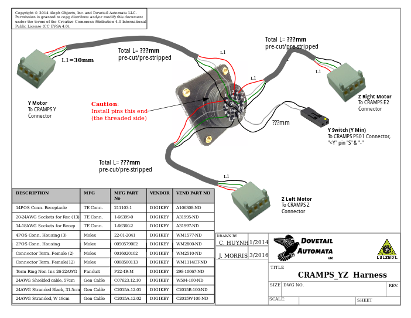
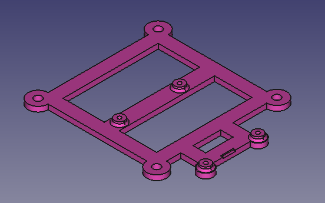
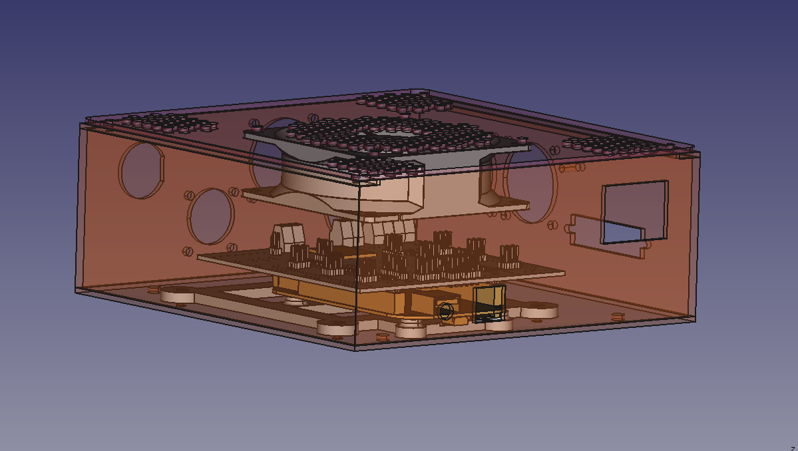

# LulzBot TAZ 5 Machinekit Retrofit #

This repo contains initial documents for retrofitting a
[LulzBot TAZ 5][1] with [Machinekit][2] running on a
[Beaglebone black][3] with a [CRAMPS][4] V2.2 cape.  It is a work in
progress.

The retrofitted controller will fit in the original TAZ 5 controller
enclosure, and will be pin-compatible with the TAZ 5 harnesses.  The
wired LCD display will be replaced with the [Machineface][5] WiFi-connected
cross-platform remote control GUI.

[1]:  https://www.lulzbot.com/store/printers/lulzbot-taz-5
[2]:  http://machinekit.io
[3]:  http://beagleboard.org/black
[4]:  http://reprap.org/wiki/CRAMPS
[5]:  https://github.com/strahlex/Machineface

## Why? ##

My artist wife needs a 3D printer for her work, and [my company][6]
does, too.  Her friend and colleague loves her TAZ 5, and online
reviews are excellent.  It's open-source hardware, and I'm a founder
of the Machinekit project, an open-source machine control software
project.  3D printers are one type of machine that Machinekit can
control, and It sounded fun to source the parts and build it myself,
and at the same time retrofit the printer with a Beaglebone wearing a
CRAMPS cape (designed by Machinekit project co-founder Charles
Steinkuehler).

Why would anyone else want to do this?  The Beaglebone opens up the
possibilities of running web servers and network control protocols to
operate and monitor the printer remotely, just one example of
integrating sophisticated features not possible with the Arduino.
Machinekit isn't the easy route: while it's been moving ten-plus-ton
steel machines in industrial settings for over two decades, it's new
(like me) to the 3D printer world, and there are still a few remaining
challenges.  The more mature Octoprint may be a lower-effort means of
bringing the Beaglebone's power to the TAZ, and the hardware portion
of this retrofit should be identical.

[6]: http://dovetail-automata.com

## Electronics ##

The CRAMPS cape turns out to be an almost perfect fit for the TAZ-5.
It is designed for 24V, and can handle the TAZ's high power
requirements.  It can drive six motors, has a 15A heated bed FET, as
well as three high-power and two low-power FET outputs for extruders
and fans.  It has more than enough GPIO for limit switches and four
analog thermistor inputs.  To connect the TAZ-5 electronics, aside
from the control box internal harness changes, it also needs a 24V to
5V DC step-down converter to power the Beaglebone and micro blower.  A
board with a LM2596S or MP1584EN costs a few dollars on eBay, and are
tiny.

The motor and low-power FET connectors are Molex KK connectors instead
of the SL connectors the TAZ uses.  I changed the latched SL
connectors to non-latch versions for the limit switch and thermistor
inputs, since they are packed together on the CRAMPS in 2-row .100
headers, and the latch would interfere.  Other connections are
replaced with terminal blocks.

See the `CRAMPS_*.svg` drawings in this repo for the changes needed to
control box internal harnesses.  If you open in inkscape, you can turn
the `CRAMPS` and `RAMBO` layers on and off to see exactly what
changed.

## Mechanical ##

The CRAMPS cape is about the same size as the RAMBO, but since it sits
atop the Beaglebone, the controller electronics are significantly
taller.  I still expect them to fit the original control box with just
a few millimeters clearance below the fan.

The Beaglebone's mounting holes are, of course, completely different.
A 3D printed part adapts the Beaglebone to the control box's threaded
inserts; see the `bbb_support_bracket.fcstd` FreeCAD model.  The
Beaglebone is attached with M3 flat head socket cap screws from the
bottom, screwing into a stand-off on top of the Beaglebone.  This is
screwed into the control box before the CRAMPS is added on top and
secured with more M3 screws into the stand-offs.  The adapter does not
yet include features to mount the DC step-down converter.

The current adapter cleverly allows access to the SD card through the
original controller box's USB port access hole.  The USB is blocked,
however, which means no WiFi.  I'm still debating whether to expose
the USB port instead (if that's possible) or whether to simply cut new
holes on the CNC mill, including extra holes for buttons, HDMI and
serial console.

